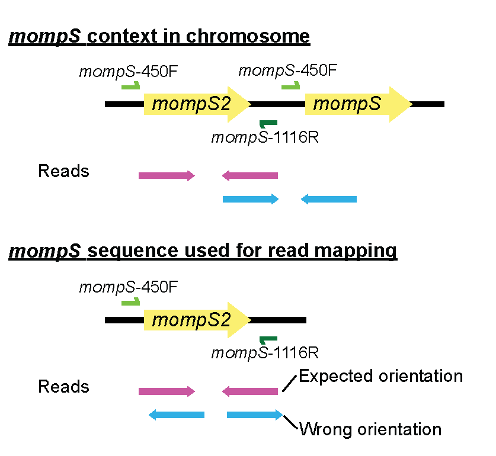

# Approach

At its core, el_gato uses [BLAST](https://blast.ncbi.nlm.nih.gov/Blast.cgi) to identify the closest match in the ESGLI database to each allele from the input data. For the loci *flaA*, *pilE*, *asd*, *mip*, and *proA*, this process is straight forward. While el_gato requires more involved processing for *mompS* and *neuA/neuAh* loci, where el_gato only encounters issues with *neuA/neuAh* when processing reads.

* [Reads](#reads)
   * [*neuA-neuAh* and Reads](#neua-neuah-and-reads)
     * [Sequence Diversity](#sequence-diversity)
   * [*mompS* and Reads](#momps-and-reads)
     * [Read Mapping Schematic](#read-mapping-schematic)
* [Assembly](#assembly)
   * [*mompS* and Assemblies](#momps-and-assemblies)

## Reads

When processing reads, identification of both *mompS* and *neuA*/*neuAh* requires additional analyses (described below). The five more straightforward loci (*flaA*, *pilE*, *asd*, *mip*, and *proA*) are processed by mapping the reads to reference loci from [*L. pneumophila* strain Paris](https://www.ncbi.nlm.nih.gov/datasets/genome/GCF_000048645.1/) and identifying the consensus sequence. Then, all alleles are determined using BLAST against the SBT allele database.

A couple of quality control steps are applied when processing the reads:

   1. **[Base quality:](https://en.wikipedia.org/wiki/Phred_quality_score)** Any bases with quality scores below 20 are not included when calculating coverage for each position or identifying alternate base calls. 

   2. **[Sequence Coverage:](https://en.wikipedia.org/wiki/Coverage_(genetics))** After excluding low-quality bases, if there is not at least one read covering 100% of the locus (>99% for *neuA*/*neuAh* - see below), then no attempt to identify the allele is made, and a "-" will be reported. [XX How this is written makes me think that one entire read must cover all base pairs, i.e., a read of ~350 bp long. I believe this is different from what it means. Instead, each position must have part of a read that overlaps that nucleotide, and we require 10 reads to cover all positions XX] A minimum depth of 10 is applied as a cutoff. 

### *neuA-neuAh* and reads

[The sequence of *neuA*/*neuAh* loci can differ dramatically.](https://doi.org/10.1111/1469-0691.12459) The differences in sequence between *neuA*/*neuAh* alleles are sufficient that reads from some alleles will not map to others. Accordingly, we map reads to six reference alleles that cover the sequence variation currently represented in the SBT database. The six reference alleles used are the *neuA* allele from strain Paris (neuA_1), the *neuAh* allele from strain Dallas-1E (neuA_201), and four other alleles (neuA_207, neuA_211, neuA_212, neuA_215) identified during the development of el_gato. The reference sequence with the best mapping (highest number of reads that map to a particular reference) is identified using `samtools coverage` with the caveat that >99% of the *neuA*/*neuAh* locus must have coverage of at least one read (some alleles contain small indels, so 100% is too strict); otherwise a "-" will be reported. Once the reference sequence is selected, the BLAST processing is the same as described above. 

#### Sequence Diversity

**Figure 1: *neuA/neuAh* Sequence Diversity -** Identified allele groups that include the known genetic heterogeneity in *neuA/neuAh* (allele group Paris and allele group Dallas-1E). We identified two [three or four] other allele groups and have tested data with the neuA_207 and neuA_211 alleles to confirm their presence.

### *mompS* and Reads

[*mompS* is sometimes present in multiple copies in the genome of *L. pneumophila*, though typically two copies.](https://doi.org/10.1016/j.cmi.2017.01.002) Duplicate gene copies pose an obvious challenge for a short read-mapping approach. If two similar sequence copies are present in a genome, reads from both copies may map to the same reference sequence, calling into question which base pairs are correctly associated with the loci of interest.

el_gato resolves this issue by taking advantage of the proximity of the genome's two copies of *mompS*. [A schematic of the organization of the two *mompS* copies can be found in Fig. 1 in this paper.](https://doi.org/10.1016/j.cmi.2017.01.002) The sequence context of the two *mompS* copies is such that the correct copy is immediately upstream of the incorrect copy. Only the correct copy is flanked on either side by sequences corresponding to primers used for conventional SBT (primer pairs: *mompS*-450F and *mompS*-1116R). For this reason, only the correct copy is amplified in conventional SBT [(see below schematic)](#read-mapping-schematic). In contrast, while *mompS*-450F sequences are present upstream of the incorrect copy, the corresponding *mompS*-1116R sequences are not found downstream. Thus, a read orientation approach allows el_gato to evaluate which reads belong to the correct *mompS* copy when using short-read sequencing data.  
 
The sequence of the two copies of *mompS* and the identity of the correct allele is resolved through the following process:

1. Reads from both *mompS* copies are mapped to a single *mompS* reference sequence flanked by the *mompS*-450F and *mompS*-1116R primer sequences. 

2. The nucleotide sequence of reads is recorded for each position within the *mompS* sequence. If the base at a particular position is heterogeneous in more than 30% of reads mapped to that position, the position is considered biallelic, and both bases are recorded. This happens when more than one copy of *mompS* is present. If only one copy of *mompS*  is present or there are multiple identical copies, then biallelic sites will be found. In this case, the sequence will be extracted, and an allele can be identified using BLAST. 

4. If multiple biallelic positions are identified, all sequences are recorded, and individual read pairs are identified, which map to each biallelic position(s). 

5. The correct allele for SBT is identified by analyzing the reads associated with each allele. Reads associated with each allele are searched for the *mompS*-1116R reverse primer sequence. The orientation of the reads that contain the primer sequence is assessed. If the primer maps 3'-5' relative to the reference sequence (i.e., in the reverse direction), this is consistent with the read pair originating from the correct copy of *mompS*. However, if the read containing the primer maps 5'-3' (i.e., in the forward direction) relative to *mompS*, this is consistent with the read pair originating from possibly the wrong copy of *mompS*. 

6. The number of reads associated with each allele that contains the primer in the correct orientation relative to *mompS* is counted and compared. The correct allele is then chosen using the following criteria:  

   a. Only one allele has associated reads with primer *mompS*-1116R correctly oriented.  

   b. One allele has more than three times as many reads with correctly oriented primer as the other.  

   c. One allele has no associated reads with the primer *mompS*-1116R in either orientation, but the other allele has associated reads with the primer in only the wrong orientation. In this case, the allele with no associated reads with the primer in either orientation is considered the primary locus by the process of elimination.
   
   d. Absence of primer-associated reads does not allow identification of the primary allele.

8. el_gato determines the number associated with a particular allele variant using BLAST and generates the ST using the identified alleles for the seven SBT genes. 

If the above process cannot identify the correct sequence, a `?` will be returned as the *mompS* allele, and el_gato will report information about the steps in this process in the [output files](input_output.md/#output-files).

Note that as the above process depends upon read pairs mapping to biallelic sites and the mompS-1116R primer region, sequence data characteristics such as read length and insert size can impact the ability of el_gato to resolve *mompS* alleles. 

#### Read Mapping Schematic

   

  

**Figure 2: Resolving *mompS* Alleles. -** a) *mompS* is sometimes found as multiple copies within *L. pneumophila*, which can have base pair variation between the copies. Sanger SBT primers target the correct copy. b) el_gato uses primer sequences and, with mapping, read orientation to assess which mompS is the correct one. 

## Assembly

Six of the seven loci (*flaA*, *pilE*, *asd*, *mip*,*proA*, and *neuA/neuAh*) are identified using BLAST. For each, the best BLAST result is returned as the allele. The closest match is returned with an \* if loci have no exact match. Only *mompS* requires extra when processing an assembly.

### *mompS* and Assemblies

[*mompS* is sometimes present in multiple copies in *Legionella pneumophila*, though typically two copies.](https://doi.org/10.1016/j.cmi.2017.01.002) When typing *L. pneumophila* using Sanger sequencing, primers amplify only the correct *mompS* locus. We, therefore, use [*in silico* PCR](https://users.soe.ucsc.edu/~kent/) to extract the correct *mompS* locus sequence from the assembly. The primers used for *in silico* PCR are *mompS*-450F (TTGACCATGAGTGGGATTGG) and *mompS*-1116R (TGGATAAATTATCCAGCCGGACTTC) [as described in this protocol](https://doi.org/10.1007/978-1-62703-161-5_6). The *mompS* allele is then identified using BLAST. 

Note that this method does not perform as well as using Illumina reads because information (read orientation and quality metrics) is lost when generating an assembly. Furthermore, because of this lack of information, the assembly method in el_gato does not do any additional quality filtering like in the reads processing approach. 
